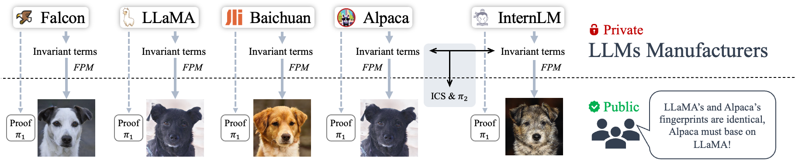

<h1 align="center">HuRef: HUman-REadable Fingerprint for Large Language Models</h1>  
This repository contains the official implementation of "HuRef: HUman-REadable Fingerprint for Large Language Models," accepted at NeurIPS 2024.

## Introduction

We present **HuRef**, a human-readable fingerprinting technique for LLMs that uniquely identifies the base model without interfering with its training or exposing model parameters. 

For more details, please refer to our [paper](https://arxiv.org/abs/2312.04828)!

<p align="center">
  
</p>

## Environment Setup

To set up the environment, follow these steps:

```bash
conda create -n huref python=3.8
conda activate huref
conda install pytorch==1.13.1 torchvision==0.14.1 torchaudio==0.13.1 pytorch-cuda=11.6 -c pytorch -c nvidia
pip install -r requirements.txt
```

## Quick Start: Generating a Fingerprint for an LLM

<p align="center">
  
</p>

### Prepare Sorted Vocabulary Tokens List:
To extract invariant terms from an LLM, we need a frequency-sorted token list. You can either use our pre-sorted token list or generate your own by running `sort_tokens_frequency.py`.

### Prepare the Encoder:
The encoder maps the invariant terms to a Gaussian feature vector. You can download our trained encoder from [this link](https://drive.google.com/file/d/1FirePAdWdDJK74sXvYxn3vVwISzvjby-/view?usp=sharing), or you can train the encoder from scratch by running `encoder_train.py` with the default settings.

Once everything is ready, generate the fingerprint using the following command:

```bash
python main.py --model_path your_model_name_or_path --sorted_tokens_path your_sorted_token_list_path --invariant_terms_saved_path your_invariant_terms_folder_path --encoder_path your_encoder_path --feature_extract_method Mean_pooling_or_CNN
```

You can choose either **Mean pooling** (a simpler method) or **CNN** for feature extraction. If you select Mean pooling, the encoder preparation step can be skipped.

## Calculating Cosine Similarity

### Parameters' Cosine Similarity (PCS) between LLMs
To calculate the PCS between LLaMA-family models (reproducing the results in Table 1), simply run:

```bash
python Parameters_Cos_Sim.py
```

### Invariant Terms' Cosine Similarity (ICS) between LLMs
To calculate ICS between LLMs, run:

```bash
python Invariant_terms_Cos_Sim.py --invariant_terms_saved_path your_invariant_terms_folder_path --ics_calcu_models llama_family_models_or_offspring_models_or_independent_models
```

You can set the `--ics_calcu_models` argument to one of the following options to reproduce the results in specific tables:
- **llama_family_models** (Table 3)
- **offspring_models** (Table 2)
- **independent_models** (Table 7)

## Contact

If you have any questions or encounter issues, feel free to [open an issue](#) or reach out to [Boyi Zeng](mailto:boyizeng@sjtu.edu.cn) at Shanghai Jiao Tong University.

## Citation

If you find this work useful, please consider citing our paper:

```bibtex
@article{zeng2023huref,
  title={HuRef: HUman-REadable Fingerprint for Large Language Models},
  author={Zeng, Boyi and Zhou, Chenghu and Wang, Xinbing and Lin, Zhouhan},
  journal={arXiv preprint arXiv:2312.04828},
  year={2023}
}
```

.